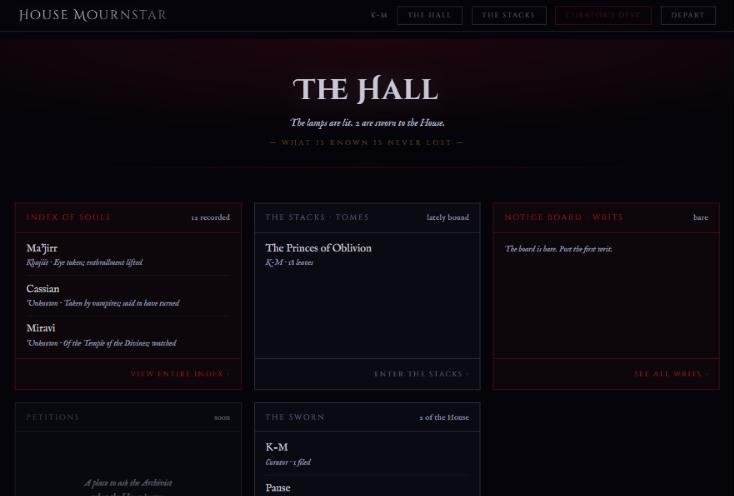
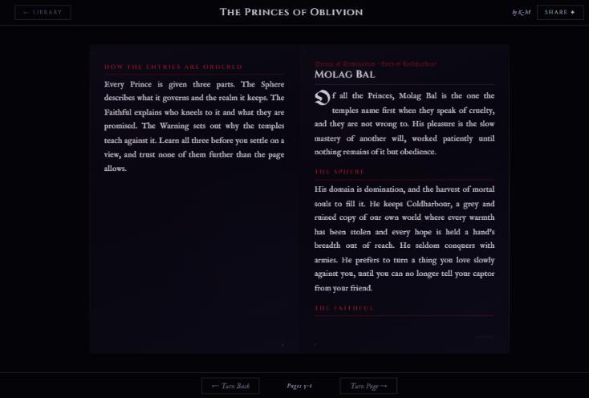
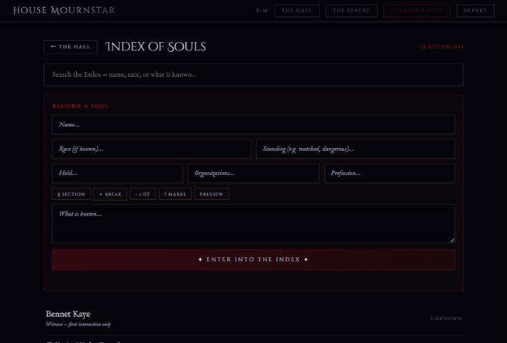

<div align="center">

# The Black Library

**A private archive for a roleplay community, where keeping the records *is* the roleplay.**

*What is known is never lost.*

[](https://github.com/AliceMasters/blackarchive/actions/workflows/ci.yml)




</div>

---

## The story

House Mournstar is an in-character *information house* in a long-running Skyrim roleplay group. Its members are archivists who keep a record of every soul in Skyrim. I built the Black Library so the software would be the fiction: writing a report, opening a dossier or pinning a writ to the Notice Board is both how you use the site and how you play your character.

It has been running in production since mid-2026 at **[theblacklibrary.ink](https://theblacklibrary.ink)** for a small, invite-only group. I designed it, built it, and run it myself.

## What it does

<table>
<tr>
<td width="50%"></td>
<td width="50%"></td>
</tr>
<tr>
<td><b>The Stacks.</b> Manuscripts are read in a page-turning book reader that paginates the text itself, so a chapter flows across pages the way it would in print. Writers use light markup (<code>##</code> headings, <code>---</code> ornamental breaks, lists) with a live preview that matches the reader exactly.</td>
<td><b>Index of Souls.</b> A shared dossier for every character the House has met: race, standing, hold, allegiances, profession and what is known about them. Any member can record or amend a soul, because the index belongs to everyone.</td>
</tr>
</table>

- **The Hall** is the landing page. Each section shows its latest activity and links through to the rest, all from a single request.
- **The Boards.** The *Notice Board* is in character, with writs tagged `SEEK`, `WATCH`, `VERIFY` or `NOTICE`. *The Antechamber* is the one room where people talk out of character.
- **The Curator's Desk** is the admin side. The curator issues accounts, **adopts** members' writing into the Master Archive and **checks out** copies to other members. Members only see what they wrote or were lent.

## Quality

This is a live service people rely on, so changes are verified before they ship.

| Layer | What it catches |
|---|---|
| **End-to-end smoke suite** (`tests/smoke.test.mjs`) | Starts the real server against a throwaway database and tests it over HTTP: signed-out requests are refused on every protected route, wrong passwords fail, the first admin account is created correctly, startup content loads, and the full create-to-delete flow of a feature works. |
| **Privacy regression** | One test checks that the public page never references an unlisted section of the site. It has to stay unlisted, so this is an automated check rather than something to remember by hand. |
| **CI** (GitHub Actions) | Every push runs a syntax check on every server file plus the smoke suite, on **Node 22 and 24**. |
| **Post-deploy verification** | After each deploy, I poll the live site for a marker from the new build before calling the release done. The host has, rarely, accepted an upload that then never went live. |
| **Safe data changes** | Schema changes only add tables or columns, and startup content loaders check what's already there first. Restarting or redeploying can never duplicate or wipe data. |

```bash
npm test     # ~3s; Node's built-in test runner, no extra dependencies
```

## How it's built

```
Browser ── one-page app (public/index.html), no build step
   │  JSON over HTTPS · signed session cookie
   ▼
server.js ── Express: auth guards (member / curator), API, startup sequence
   │
   ▼
db.js ── SQLite (sql.js, WebAssembly) ── archive.db on a persistent Railway volume
```

**Decisions, and why I made them:**

- **SQLite in one file, via sql.js.** For a community this size, one service and one database file are the whole operational burden. The library is pure JavaScript, so the Docker build needs no native compilers.
- **No front-end build step.** What's in the repo is exactly what ships, which makes it easy to debug live in the browser.
- **Content loads at startup, safely.** Reference books and lore records load themselves on boot and skip anything already there. Versioned content (like *The Princes of Oblivion*) is rewritten in place when its version number is raised, so editorial changes ship with a normal deploy.
- **Closed by default.** Every route except sign-in requires a session. Passwords are hashed with bcrypt, and session cookies are `httpOnly` and `sameSite=lax`.

## Run it

```bash
npm install
cp .env.example .env         # set SESSION_SECRET, plus ADMIN_PASS to create a local curator
npm run dev                  # http://localhost:3000
```

Requires Node 22.13 or newer. It deploys to Railway from the included `Dockerfile` with `railway up`. The database must sit on a persistent volume mounted at `/app/data`.

<details>
<summary><b>Configuration</b></summary>

| Variable | Default | Purpose |
|---|---|---|
| `SESSION_SECRET` | dev placeholder | Signs session cookies. **Required in production.** |
| `DATA_DIR` | `./data` | Where `archive.db` lives. Must be a persistent volume in production. |
| `PORT` | `3000` | Listen port. Railway sets this automatically. |
| `ADMIN_NAME` | `K-M` | Codename of the curator account. |
| `ADMIN_PASS` | — | Creates the curator account on first boot. |
| `ADMIN_RESET` | — | Set to `1` together with `ADMIN_PASS` to change the curator's password. |
| `PAUSE_PASS` | — | Password for the seeded account that owns the bundled incident report. |

</details>

<details>
<summary><b>Data model</b></summary>

| Table | Holds |
|---|---|
| `scribes` | Accounts: codename, bcrypt hash, admin flag |
| `works` / `entries` | Manuscripts and their ordered entries. `archived` marks Master Archive works |
| `holdings` | Which member has been lent which work |
| `souls` | Index of Souls dossiers |
| `posts` | Board threads and replies |
| `mentions` / `investigations` | Reserved for linking reports to the souls they mention (planned) |

</details>

<details>
<summary><b>API reference</b></summary>

🔒 = signed-in member, 👑 = curator

| Method | Path | Auth | |
|---|---|---|---|
| `POST` | `/api/auth/login` · `/api/auth/logout` | — | Sign in / out |
| `GET` | `/api/auth/me` | — | Current session (also the health check) |
| `GET` | `/api/hall` | 🔒 | Everything the Hall shows, in one call |
| `GET` `POST` `PUT` `DELETE` | `/api/works[/:id]`, `/api/library` | 🔒 | Manuscripts (editing is owner-only) |
| `GET` `POST` `PUT` | `/api/souls[/:id]` | 🔒 | Index of Souls (`?q=` search) |
| `GET` `POST` `DELETE` | `/api/board/:board[/reply]`, `/api/board/post/:id` | 🔒 | Notice Board and Antechamber |
| various | `/api/admin/users…`, `/adopt`, `/release`, `/assign`, `/unassign`, `/archive`, `/pending` | 👑 | Curator's Desk |

</details>

## Roadmap

- [ ] **Keep people signed in across deploys.** Sign-ins currently live in server memory, so every deploy logs everyone out.
- [ ] **Nightly off-site backups** of `archive.db`
- [ ] **Soul cross-referencing.** Link reports to the souls they mention automatically, and collect unknown names as leads to investigate.
- [ ] **Petitions to the Archivist,** where members can ask the House for information in character
- [ ] Port the old HTTP seeder (`scripts/seed.mjs`) to the invite-only API

---

<sub>Built and maintained by <a href="https://github.com/AliceMasters">Alice Masters</a>. Screenshots are from a local copy running only the bundled sample content, not real members' data.</sub>
